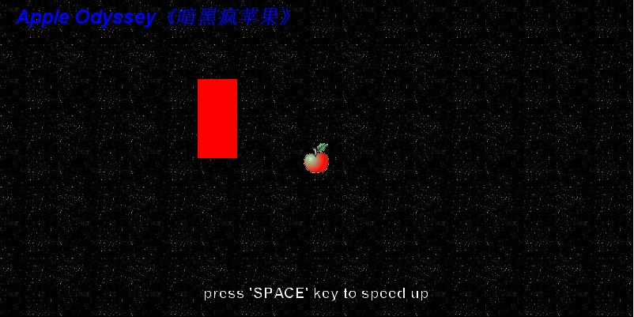

0 - the first game demo from learning Greenfoot

## Apple Odyssey

### Intro

It's almost a game, made by Greenfoot. And I named it "Apple Odyssey".

What is "Apple Odyssey"? It's a mood game with an apple singing around the space.

The story is about an apple sang a crazy song and got deeper in black. In the deepest black, there is the blue water and it can heal everything, including the injured mind. But things never gonna easy as was heard. At the cost of being lost in the darkness forever until we return to the place where the dream began. An apple has pale skin and want change its color. Here it go.

The goal of this game is simple and awesome: drive your mood crazy.

"Apple Odyssey" is published on  https://www.greenfoot.org/scenarios/23856 and you can goto play on-line. Since the game is built under the [LICENSE](./LICENSE) of GPL 3.0 so you can share it under it. If there were anything wrong, feel free to leave messages to let me know or fix. Thanks.

An relative article is posted on ting's blogs named "[it's a mood game](https://tatatingting.github.io/post/2019-06-01-214)" and you can check it out.

**中文版简介：暗黑疯苹果**

这是一个Greenfoot工具制作的游戏半成品，我称之为“情绪游戏”。命名为：暗黑疯苹果。

一只苹果麦克疯，堕入无边黑暗。

传说，在无边黑暗的最深处，有一汪清泉，能治愈一切，包括受伤的心灵。事情当然没这么简单，代价是会永远迷失在黑暗中，直至回到梦开始的地方。一个苹果皮肤苍白，想要改变它的颜色。故事开始了。这款游戏的目标就是“使玩家陷入错乱、奋斗、无望的情绪”。

《暗黑疯苹果》发布在 https://www.greenfoot.org/scenarios/23856，您可以在线玩耍。 由于游戏是在GPL 3.0许可证下构建的，因此您共享它的时候记得遵守哦！ 有一篇题为《[这是一款情绪游戏](https://tatatingting.github.io/post/2019-06-01-214)》的报道，您可以查看。如果有任何问题，请随时留言让我知道或解决。谢谢啦。

### Start

提供了点开即可玩的方式，可直接登陆网页  https://www.greenfoot.org/scenarios/23856。另外，也可以通过开发工具测试，具体方法是安装Greenfoot，并打开`gfar`安装包。

### Rebuild

1. 游戏地图（迷宫靶场）：范围，目标，区域。
2. 让它走起来：速度，方向。
3. 随机游走：随机种子，速度应变，方向应变。
4. 包装：换装素材，背景音乐，音效。
5. 提示信息：开始，结束。

